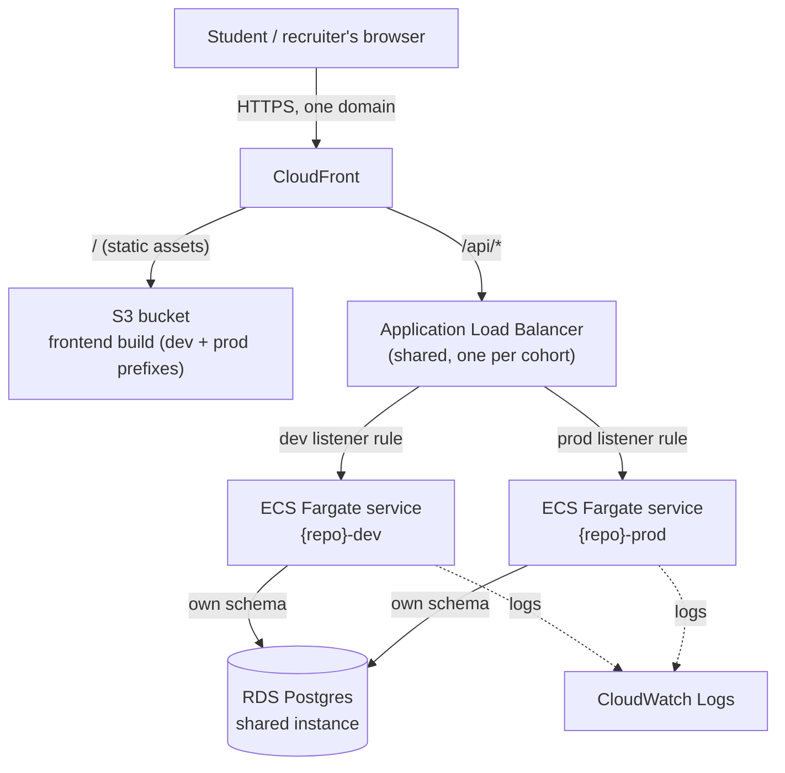

# Student sandbox — AWS resource design (v2: Python web app on ECS Fargate)

**Supersedes the earlier Lambda-based design.** The app is now a Python
(FastAPI) API + static frontend, matching what a student would actually be
handed in a real job: an existing web app, not a from-scratch build. See
`business-model.md` §7.2–7.3 for the *principles* this implements (shared
account, namespaced resources, no student ever touches the AWS console).

## Why this shape

A working engineer's first ticket is almost never "design a system." It's
"add an endpoint to *this* one" or "fix *this* bug." So what students get on
day one is a small, already-deployed, already-architected app — the
architecture below — and their first ticket is to extend it. Sprint 2's
ticket is a bug in what they just shipped. Two sprints, four weeks.

## Two environments, not one — dev and prod

Every student gets **two** copies of their resources, not one: `dev` and
`prod`. Every push to `main` deploys straight to `dev` automatically — that's
their own sandbox to break and test in. Going live in `prod` is a separate,
deliberate step: raise a **change ticket**, get it approved, then a
`promote-to-prod` action ships the exact image already verified in `dev` —
never a fresh build. This is real change-management practice, not a teaching
invention, and it maps directly onto a GitHub-native mechanic:

- **GitHub Environments**: `dev` has no protection rules (auto-deploys on
  push). `prod` has a required reviewer — approving that review *is* the
  change ticket's approval step. No separate ticketing tool needed to get
  the mechanic right for the pilot; Jira can carry the ticket record itself
  later without changing how the gate works.
- **Promotion, not rebuild**: the promote workflow takes the image tag
  already running in `dev` and deploys that same image to `prod`'s ECS
  service — the whole point is proving the exact artifact that was tested,
  not re-building from source a second time (a real source of "worked in
  dev, broke in prod" bugs when done wrong).

## Architecture

One domain, no CORS to fight — CloudFront is the single entry point and
routes by path: `/api/*` to the load balancer, everything else to the S3
frontend.

## Shared vs. per-student (× dev/prod) — same principle as before

| Resource | Shared or per-student | Notes |
|---|---|---|
| CloudFront distribution | Shared | Routes by path; a `dev.`/no-prefix subdomain split is an option later |
| S3 bucket | Shared | Prefixes: `{repo}/dev/`, `{repo}/prod/` |
| Application Load Balancer | **Shared** | One ALB, listener rules per student **and per environment** — an ALB per student×env (48+ for a 24-student cohort) would be real, avoidable fixed cost |
| ECS cluster | Shared | Fargate is billed per-use; no reason to isolate the cluster |
| ECS service + task definition | **Per-student, per-environment** | `gradsfoundry-{repo}-dev` and `gradsfoundry-{repo}-prod` — two independent, independently-torn-down services |
| RDS instance | **Shared** | One Postgres instance; isolation is a schema per student *and* per environment (`student_{repo}_dev`, `student_{repo}_prod`) |
| ECR repository | Per-student (shared across dev/prod) | `gradsfoundry/{repo}` — one repo, images promoted between environments by tag, not rebuilt |
| IAM deploy role | Per-student | One role can deploy to both that student's `dev` and `prod` services — the *approval gate* is what protects prod, not a separate identity |
| CloudWatch log group | Per-student, per-environment | `/ecs/gradsfoundry-{repo}-dev`, `/ecs/gradsfoundry-{repo}-prod` |

## The app itself

- **Backend**: FastAPI, one route so far: `GET /api/health` — reports app
  status and whether it can reach the database (a real, useful health
  check, not a placeholder). Runs as a normal `uvicorn` process — no
  Lambda-specific adapter needed, since Fargate runs a normal long-lived
  container behind a load balancer. Simpler than the Lambda version it
  replaces, not just different.
- **Frontend**: one static page that calls `/api/health` and shows the
  result — intentionally close to empty. Sprint 1's ticket is to add the
  first real feature to both sides of this.
- **Database**: connects via `DATABASE_URL` (an env var set per ECS task,
  pointed at that student's own schema for that environment on the shared
  RDS instance). No tables exist yet — Sprint 1's ticket includes writing
  the first migration.

## What's still open (the next build increment)

The previous Lambda-era `infra/bootstrap-org.sh`, `provision-student.sh`,
and `teardown.yml` are removed — they provisioned the wrong resources
(Lambda, Function URLs) for this architecture and would be actively
misleading left in place. Replacements need real networking design (VPC,
subnets, security groups for the ALB and Fargate tasks, RDS subnet group)
*and* the dev/prod-aware IAM and ECS setup above — worth doing carefully
against an actual AWS account rather than scripted blind. That's the next
concrete step, not this one.
